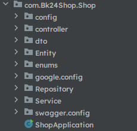
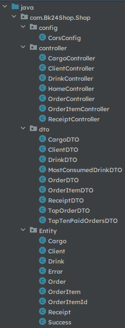
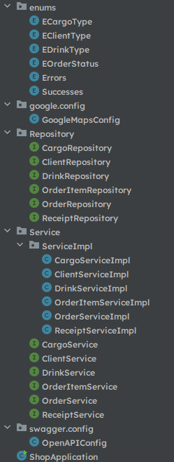
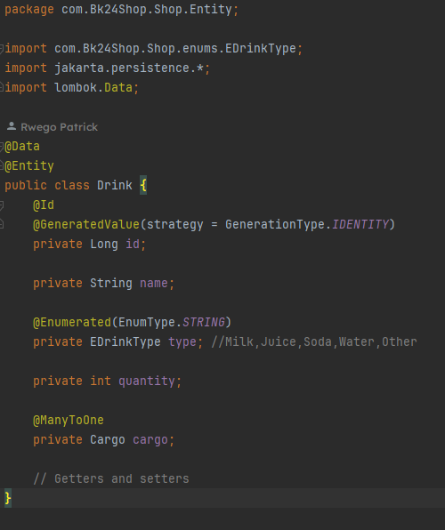
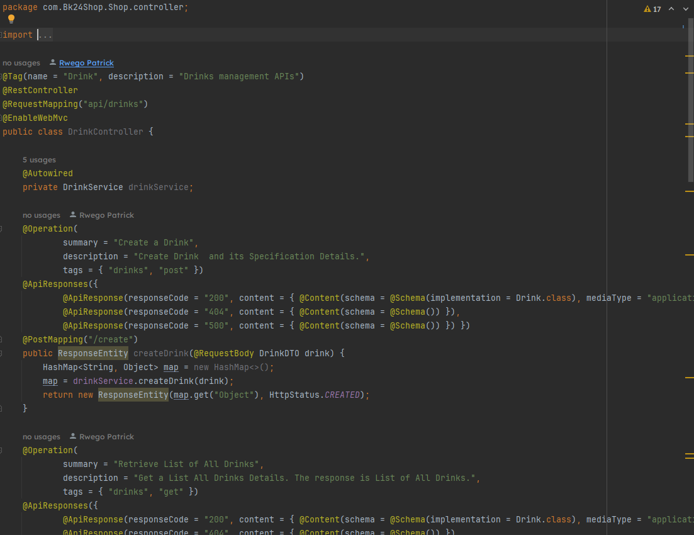
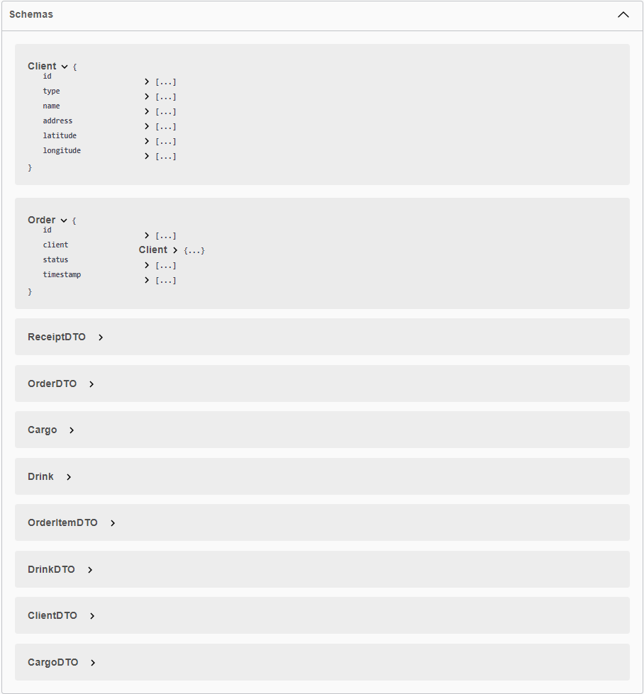
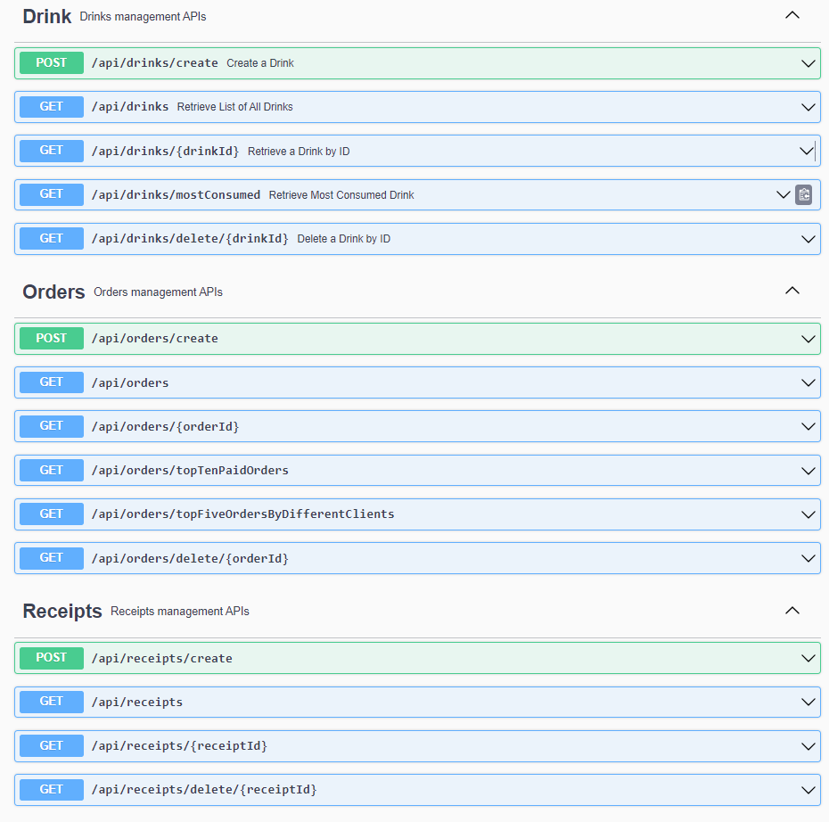
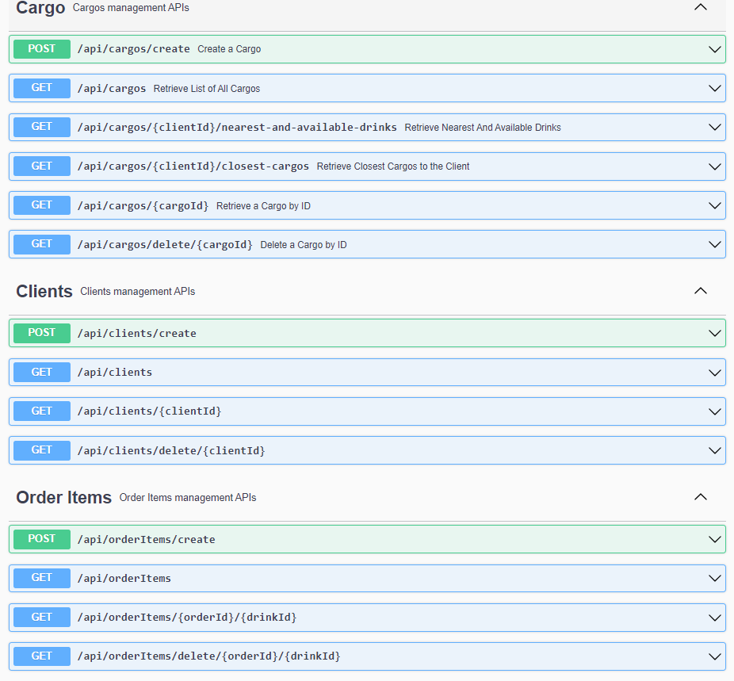
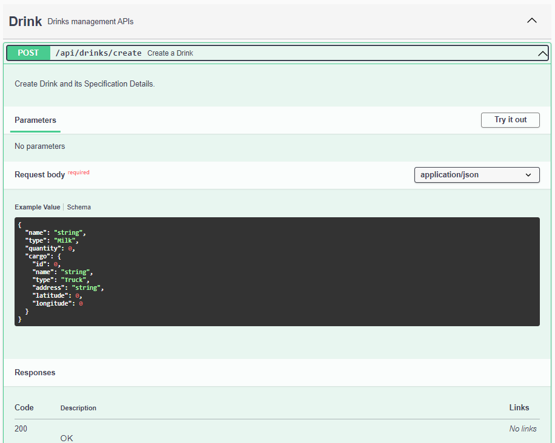
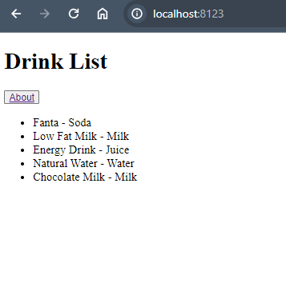

### Shop24
BPR Internship Shop24 Challenge

## Introduction to Shop24

### Who is Shop24?
Shop24 is a soft drinks wholesaler based in Kigali. They would like to avail their services to the public by providing a white-label solution to the
existing retailer companies/hotels. Practically, they will build a set of APIs that hotels will use to manage their requests to buy from
Shop24 and transport to their clients. They would like your help building these APIs and document them using swagger

### Technology constraints
• At the BPR PLC Bank, we currently have a microservices architecture with services mostly written in Spring Boot (Java or Kotlin).

• We would like you to develop a single service in either Spring Boot that exposes several REST endpoints (see next page)

• You can use whatever database you want (we recommend using SQLite, MySQL or Postgres)

• You should include a README file that has instructions for us to get the solution running on our machines


## API Requirements for Shop24

### DRINKS
• Get a list of all drinks.

• Get a list of the most consumed drinks and quantity.

• Get a list of all available drinks and the nearest cargo company to the client within 3km based on the client's location.

• Get a specific drink by ID.

### ORDER
• Create a new 'order' request by assigning a list of drinks to a specific client.

• Choose the top five orders that were requested by different clients.

• Get the top 10 paid orders, their client details, and transporter details.

• Complete an order.

### CLIENT
• Get a list of all clients.

• Get a specific client by ID.

• For a specific retailer client/hotel, get a list of the 3 closest cargo companies.

### CARGO
• Get a list of all cargo companies

• Get a specific cargo company by ID

• For a specific cargo company, get a list of drinks transported by date range

# Technologies Used

* IDE: IntelliJ IDEA
* Java 8
* SpringBoot
* Maven
* MySql
* JPA Hibernate
* Lombok
* Openapi
* Google-maps-services API
* Jackson-module-kotlin
* Thymeleaf
* Postman

# Project Structure





### Example of one Entity (Drink Entity)



### Example of one Controller (Drink Controller)




## Data models and Sprint development



## Patterns for REST and APIs





## You can even Try with Swagger




## How to Interract with this project with Postman
* Clone the Project on GitHub this is the command for git``gh repo clone pattusdev/Shop24_Backend``
* Go to the Directory of the project after then click ``mvn --version`` or ``mvn install``
* Run the Project ``mvn spring-boot:run``
* The project should run the on ``http://localhost:8123/`` due to the ``application.properties`` file


### Samples with Postman
``http://localhost:8123/api/drinks`` this Endpoint is for List all Available Drinks

```
[
    {
        "id": 1,
        "name": "Fanta",
        "type": "Soda",
        "quantity": 5000,
        "cargo": {
            "id": 2,
            "name": "Bralirwa",
            "type": "Van",
            "address": "Kigali",
            "latitude": -1.970501,
            "longitude": 30.095839
        }
    },
    {
        "id": 2,
        "name": "Low Fat Milk",
        "type": "Milk",
        "quantity": 1500,
        "cargo": {
            "id": 1,
            "name": "Inyange",
            "type": "Truck",
            "address": "Kigali",
            "latitude": -1.913221,
            "longitude": 30.086846
        }
    },
    {
        "id": 3,
        "name": "Energy Drink",
        "type": "Juice",
        "quantity": 8000,
        "cargo": {
            "id": 4,
            "name": "Azam Rwanda",
            "type": "Van",
            "address": "Kigali",
            "latitude": -1.929772,
            "longitude": 30.151907
        }
    },
    {
        "id": 4,
        "name": "Natural Water",
        "type": "Water",
        "quantity": 5000,
        "cargo": {
            "id": 5,
            "name": "Sulfo",
            "type": "Truck",
            "address": "Kigali",
            "latitude": -1.944874,
            "longitude": 30.057333
        }
    },
    {
        "id": 5,
        "name": "Chocolate Milk",
        "type": "Milk",
        "quantity": 6000,
        "cargo": {
            "id": 3,
            "name": "Mukamira Kigali",
            "type": "Truck",
            "address": "Kigali",
            "latitude": -1.996836,
            "longitude": 30.145976
        }
    }
]
```

### Now we need a view in MVC
* you can use Thymeleaf + jQuery + AJAX

or

* Open another Server: Reactjs

### I tried to use Thymeleaf but React was better and powerful


